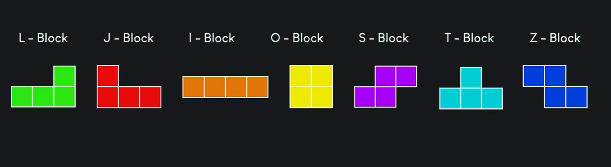
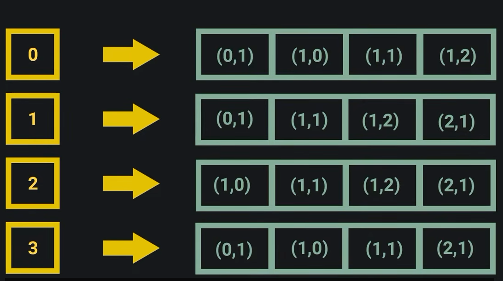
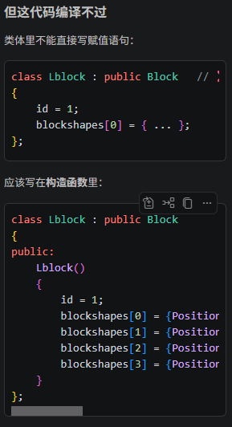
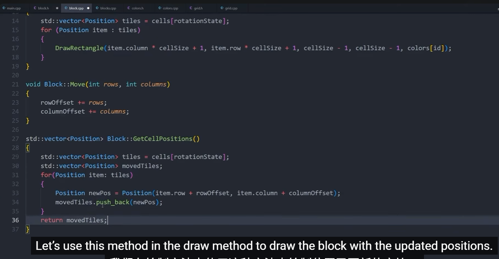

# Tetris

## game loop
- 创建窗口
- 需要初始化窗口InitWindow，配套关闭窗口
- 设置帧数
- 游戏循环

## grid画网格
- 记录格数
- 初始化每个格子
- 颜色对应，每个颜色对应一个数字
  

## 创建方块
- 
- 7种方块，同时需要实现旋转，运用继承
  - 类Block包含color，占用方块位置（状态），
  - 
  - 使用map存储状态
- 创建单独colors.h全局管理颜色
- 创建position.h存放4*4方格中每个形状的位置，也就是二维坐标
- 继承父类block的blocks，只能修改public与protect，不能修改private
- 移动工作
- 创建game，统筹功能与属性，实现随机block，后续管理键盘移动与旋转与碰撞
- 旋转回退
~~~cpp
  void Block::undorotate()
{
    rotationState=(rotationState-1+cells.size())%cells.size();
}
~~~
- 实现自动下落
~~~cpp
void game::AutoMoveDown()
{
    if(EventTriggered(0.2))
    {
        currentBlock.move(1, 0); // 向下移动
         if(IsBlockOutside())
        {
            currentBlock.move(-1,0);
        }
    }
}
bool game::EventTriggered(double interval)
{
    currenttime=GetTime();
    if(currenttime-lasttime>=interval)
    {
        lasttime=currenttime;
        return true;
    }
    return false;
}
~~~
- 实现锁定与更新新物块
  - 自动下落调用下降模块，如果单独写需要分别判断是自由下落或者操控下落，抽离下降模块；
  - 锁定更新数据到grid，将操控块变成下一个